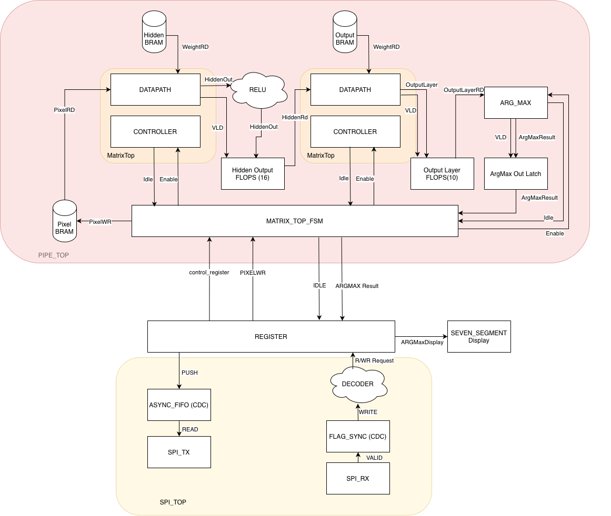

# fpga_accel

# Goals:
- Goal of this project is to learn RTL design concepts:
    - uArch writing
    - Data flow
    - Synthesis
    - CDC methods
    - FIFOs, BRAMs
    - SPI
- No AI is used to write any RTL. It is only used to talk architecture discussions, write Cmake compile files (because no one wants to do that by hand), basic test benches, and python scripts.

# Project Goal
- The project started with implementing SPI communication between ESP32 and NandLand GO board. Slowly it evolved to have a timer peripheral, then systolic array multiplier peripheral, and final stage is a MINST number inference accelerator. 
- The final project will be:
    - ESP32 streaming 28x28 pixel data and control signals to FPGA
    - FPGA will have hardware implementation for the model with hidden layer, RelU, Output, and Argmax layers. 
    - Weights and biases will be stored on BRAM in FPGA for now (later planned to improve to have those programmable from ESP32 for accelerator flexibility). This is a tradeoff - hardcoded model for simplicity for learning.
    - FPGA will display predicted value on seven segment and have it readable via SPI to ESP32.
    - SPI will be full duplex - implementing reads and writes.

# Hardware
- The project started with Nandland GO Board FPGA. The 1k flop area proved to be too small to hold the systolic array for 28x28 inference. I bought a Nexys A7 100T to implement.
- Incremental testing was done in stages. The flow was to implement a small set of the project, verify in simulation, then synthesis onto the FPGA for real testing.

# uArch Diagram

# Performance Calculation
- TBD

# Storage Calculation
- TBD

# Limitations/Tradeoffs
- TBD

# Future Work
-TBD

# Stuff Learned
TBD
